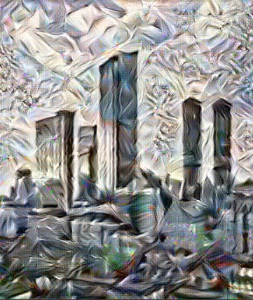

# Observations in NST trials with RESNET50
Trials by style weight and content weight gave bad results so used the optimal values provided in Kaggles documentation of RESNET50 NST
Main trials were in learning rate and layers chosen. Increased learning rate from 0.01 to 20 which made the change in image appear drastically every 100 iterations

| Layers | Conv(block 2-block 3x2-block 4) | ReLu(blocks 2,3,4,5) |
| :-: | :-: | :-: |
| Learning rate=0.01 |  |  |

| Style | Conv(block 2-block 3x2-block 4)  | ReLu(blocks 2,3,4,5)  |
| :-: | :-: | :-: |
|  | | |
|  |  |  |

# Testing ReLu layers on geometrically defined style images yielded much better results wrt conv layers

| Test image | Conv | ReLu |
| :-: | :-: | :-: |
|  |  | |

| Conv | ReLu | Relu+Conv |
| :-: | :-: | :-: |
|  |  |  |
|  |  |  |

# Some trials with excessive style weight (e8-e12)

# Update on new layers used
style_layers = ['conv1_relu','conv2_block1_1_conv', 
                'conv2_block2_1_relu', 'conv2_block2_1_relu', 'conv2_block3_3_conv','conv2_block2_2_relu','conv4_block2_1_conv','conv2_block2_1_relu', 'conv2_block2_1_relu', 'conv2_block3_3_conv','conv2_block2_2_relu', 'conv4_block2_1_relu', 'conv4_block2_2_conv', 'conv4_block2_2_relu', 'conv4_block2_3_conv’]

Trials moving style layers higher to increase robustness.

| Before | After |
| :-: | :-: |
|   |   |

